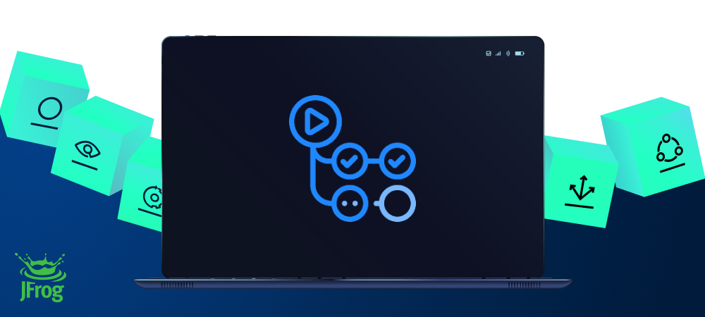

[](#readme)

<div align="center">

# Setup JFrog CLI

[](https://github.com/jfrog/frogbot#readme)
[](https://github.com/jfrog/setup-jfrog-cli/actions)

</div>

This GitHub Action downloads, installs and configures JFrog CLI, so that it can be used as part of the workflow.

Additionally, the Action incorporates the following features when utilizing JFrog CLI to interact with the JFrog Platform:
* Two distinct methods are available for authenticating with the JFrog Platform. Explore more details [here](#authorization)
* There's no need to add the *build name* and *build number* options and arguments to commands which accept them.
All build related operations will be automatically recorded with the *Workflow Name* as build name and *Run Number* as build number.

# Usage
## General

```yml
- uses: jfrog/setup-jfrog-cli@v3
- run: jf --version
```
# Authorization
JFrog CLI operates in conjunction with the JFrog Platform. In order to facilitate this connection, certain connection details of the JFrog Platform must be provided.
There exist two methods to provide these details, and you only need to choose **one** method:
* The connection details of the JFrog platform can be stored as secrets. Read more about it [here](#storing-jfrog-connection-details-as-secrets).
* The connection details of the JFrog platform can be auto-generated using OpenID Connect protocol. Read more about it [here](#connect-using-openid-connect).


## Storing JFrog connection details as secrets
The connection details of the JFrog platform used by JFrog CLI can be stored as secrets.
You can use one of the following two methods to define and store the JFrog Platform connection details as secrets.
1. [Storing the connection details using separate environment variables](#Storing-the-connection-details-using-separate-environment-variables).
2. [Storing the connection details using single Config Token](#Storing-the-connection-details-using-single-Config-Token).

### Storing the connection details using separate environment variables
You can set the connection details to your JFrog Platform by using one of the following environment variables combinations:
1. JF_URL (no authentication)
2. JF_URL + JF_USER + JF_PASSWORD (basic authentication)
3. JF_URL + JF_ACCESS_TOKEN (authentication using a JFrog Access Token)

You can use these environment variables in your workflow as follows:
```yml
- uses: jfrog/setup-jfrog-cli@v3
  env:
    # JFrog platform url (for example: https://acme.jfrog.io) 
    JF_URL: ${{ secrets.JF_URL }}
    
    # Basic authentication credentials
    JF_USER: ${{ secrets.JF_USER }}
    JF_PASSWORD: ${{ secrets.JF_PASSWORD }}
    or
    # JFrog Platform access token
    JF_ACCESS_TOKEN: ${{ secrets.JF_ACCESS_TOKEN }}
- run: |
    jf rt ping
```

| Important: If both Config Token(JF_ENV_*) and separate environment variables(JF_URL, ...) are provided, the default config will be the Config Token. To make the above separate environment variables as the default config use ```jf c use setup-jfrog-cli-server``` |
|----------------------------------------------------------------------------------------------------------------------------------------------------------|

### Storing the connection details using single Config Token
1. Make sure JFrog CLI is installed on your local machine by running ```jf -v```.
2. Configure the details of the JFrog platform by running ```jf c add```.
3. Export the details of the JFrog platform you configured, using the server ID you chose. Do this by running ```jf c export <SERVER ID>```.
4. Copy the generated Config Token to the clipboard and save it as a secret on GitHub.

To use the saved JFrog platform configuration in the workflow, all you need to do it to expose the secret to the workflow.
The secret should be exposed as an environment variable with the *JF_ENV_* prefix.
Here's how you do this:
```yml
- uses: jfrog/setup-jfrog-cli@v3
  env:
    JF_ENV_1: ${{ secrets.JF_SECRET_ENV_1 }}
- run: |
    # Ping the server
    jf rt ping
```
As you can see in the example above, we created a secret named *JF_SECRET_ENV_1* and exposed it to the workflow 
as the *JF_ENV_1* environment variable. That's it - the ping command will now ping the configured Artifactory server.

If you have multiple Config Tokens as secrets, you can use all of them in the workflow as follows:
```yml
- uses: jfrog/setup-jfrog-cli@v3
  env:
    JF_ENV_1: ${{ secrets.JF_SECRET_ENV_1 }}
    JF_ENV_2: ${{ secrets.JF_SECRET_ENV_2 }}
- run: |
    # Set the JFrog configuration to use by providing the server ID (configured by the 'jf c add' command).
    jf c use local-1
    # Ping local-1 Artifactory server
    jf rt ping
    # Now use the second sever configuration exposed to the Action.
    jf c use local-2
    # Ping local-2 Artifactory server
    jf rt ping
```
| Important: When exposing more than one JFrog configuration to the Action, you should always add the ```jf c use``` command to specify the server to use. |
|----------------------------------------------------------------------------------------------------------------------------------------------------------|

## Connect using OpenID Connect
The sensitive connection details, such as the access token used by JFrog CLI on the JFrog platform, can be automatically generated by the action instead of storing it as a secret in GitHub. 
This is made possible by leveraging the OpenID-Connect (OIDC) protocol. This protocol can authenticate the workflow issuer and supply a valid access token, requiring only the JF_URL environment variable.
To utilize the OIDC protocol, follow these steps:
### Platform configuration (To be performed once):
1. **[Configure an OIDC Integration](https://jfrog.com/help/r/jfrog-platform-administration-documentation/configure-an-oidc-integration)**: This phase sets an integration between the Action to the JFrog platform.

| NOTE:                                                                                                                                                                                                                                          |
|------------------------------------------------------------------------------------------------------------------------------------------------------------------------------------------------------------------------------------------------|
| The value specified as the 'Provider Name' should be used as the oidc-provider-name input in [Workflow configuration step 2](#workflowstep2) below.                                                                                            |
| The 'Audience' field does not represent the 'aud' claim for insertion into the identity-mapping in [Platform configuration step 2](#platformstep2) below. Only the claims included in the Claims Json created during step 2 will be validated. |

<div id="platformstep2"/>

2. **[Configure an identity mapping](https://jfrog.com/help/r/jfrog-platform-administration-documentation/configure-identity-mappings)**: This phase generates a reference token for authenticating against the JFrog platform. It involves defining the necessary details to enable server authentication of the action issuer and granting the issuer an appropriate access token. 
You have the flexibility to define any valid list of claims required for request authentication. You can check a list of the possible claims [here](https://docs.github.com/en/actions/deployment/security-hardening-your-deployments/about-security-hardening-with-openid-connect#understanding-the-oidc-token).
Example Claims JSON:
   ```json
   {
      "sub": "repo:my-user-name/project1:ref:refs/heads/main", 
      "aud": "https://github.com/my-user-name",
      "ref": "refs/heads/main",
      "repository": "my-user-name/project1",
      "iss": "https://token.actions.githubusercontent.com"
   }
   ```
### Workflow configuration (To be performed per workflow):
1. **Set required permissions**: In the course of the protocol's execution, it's imperative to acquire a JSON Web Token (JWT) from GitHub's OIDC provider. To request this token, it's essential to configure the specified permission in the workflow file:
   ```yml
   permissions:
     id-token: write
   ```
<div id="workflowstep2"/>

2. **Pass the 'oidc-provider-name' input to the Action (Required)**: The 'oidc-provider-name' parameter designates the OIDC configuration whose one of its identity mapping should align with the generated JWT claims. This input needs to align with the 'Provider Name' value established within the OIDC configuration in the JFrog Platform.
3. **Pass the 'oidc-audience' input to the Action (Optional)**: The 'oidc-audience' input defines the intended recipients of an ID token (JWT), ensuring access is restricted to authorized recipients for the cloud (Artifactory). By default, it contains the URL of the GitHub repository owner.
This value, if transmitted, will be used as an argument in core.getIDToken(), which generates the JWT. It enforces a condition, allowing only workflows within the designated repository/organization to access the cloud role. Read more about it [here](https://docs.github.com/en/actions/deployment/security-hardening-your-deployments/about-security-hardening-with-openid-connect#customizing-the-audience-value).

    ```yml
    - name: Install JFrog CLI
      uses: jfrog/setup-jfrog-cli@v3
      env:
        JF_URL: ${{ secrets.JF_URL }}
      with:
        oidc-provider-name: <Provider Name value given in step 1>
        oidc-audience: <URL to the intended audience>
    ```

## Setting the build name and build number when publishing build-info to Artifactory
The Action automatically sets the following environment variables:
*JFROG_CLI_BUILD_NAME* and *JFROG_CLI_BUILD_NUMBER* with the workflow name and run number respectively.
You therefore don't need to specify the build name and build number on any of the build related JFrog CLI commands.

In the following example, all downloaded files are registered as dependencies of the build and all uploaded files
are registered as the build artifacts. 
```yml
- run: |
    jf rt dl artifacts/
    jf rt u aether artifacts/
    jf rt bp
```

## Setting JFrog CLI version
By default, the JFrog CLI version set in [action.yml](https://github.com/jfrog/setup-jfrog-cli/blob/master/action.yml) is used. To set a specific version, add the *version* input as follows:

```yml
- uses: jfrog/setup-jfrog-cli@v3
  with:
    version: X.Y.Z
```

It is also possible to set the latest JFrog CLI version by adding the *version* input as follows:

```yml
- uses: jfrog/setup-jfrog-cli@v3
  with:
    version: latest
```

| Important: Only JFrog CLI versions 1.29.0 or above are supported. |
| --- |

## Downloading JFrog CLI from Artifactory
If your agent has no Internet access, you can configure the workflow to download JFrog CLI from a [remote repository](https://www.jfrog.com/confluence/display/JFROG/Remote+Repositories) in your JFrog Artifactory, which is configured to proxy the official download URL.

Here's how you do this:

1. Create a remote repository in Artifactory. Name the repository jfrog-cli-remote and set its URL to https://releases.jfrog.io/artifactory/jfrog-cli/
2. Set *download-repository* input to jfrog-cli-remote:
    ```yml
    - uses: jfrog/setup-jfrog-cli@v3
      env:
       # JFrog platform url (for example: https://acme.jfrog.io) 
        JF_URL: ${{ secrets.JF_URL }}
    
        # Basic authentication credentials
        JF_USER: ${{ secrets.JF_USER }}
        JF_PASSWORD: ${{ secrets.JF_PASSWORD }}
    
        # JFrog platform access token (if JF_USER and JF_PASSWORD are not provided)
        # JF_ACCESS_TOKEN: ${{ secrets.JF_ACCESS_TOKEN }}
   
        # Same can be achieved with a Config Token using JF_ENV_1 environment variable
        # JF_ENV_1: ${{ secrets.JF_SECRET_ENV_1 }}
      with:
        download-repository: jfrog-cli-remote
    ```

* See instructions for configuring the JFrog connection details under [Storing JFrog connection details as secrets](#storing-jfrog-connection-details-as-secrets).


## Set up a FREE JFrog Environment in the Cloud
Need a FREE JFrog environment in the cloud to use with this GitHub Action? Just run one of the following commands in your terminal. The commands will do the following:

1. Install JFrog CLI on your machine.
2. Create a FREE JFrog environment in the cloud for you.

**MacOS and Linux using cUrl**
```
curl -fL "https://getcli.jfrog.io?setup" | sh
```

**Windows using PowerShell**
```
powershell "Start-Process -Wait -Verb RunAs powershell '-NoProfile iwr https://releases.jfrog.io/artifactory/jfrog-cli/v2-jf/[RELEASE]/jfrog-cli-windows-amd64/jf.exe -OutFile $env:SYSTEMROOT\system32\jf.exe'" ; jf setup
```

## Example projects
To help you get started, you can use [these](https://github.com/jfrog/project-examples/tree/master/github-action-examples) sample projects on GitHub.

# Developing the Action code
## Build the code
If you'd like to help us develop and enhance this Action, this section is for you.

To build and run the Action tests, run
```bash
npm i && npm t
```

## Code contributions
We welcome code contributions through pull requests.

Please help us enhance and improve this Action.
### Pull requests guidelines
- If the existing tests do not already cover your changes, please add tests.
- Please run `npm run format` for formatting the code before submitting the pull request.

# License
This Action is licensed under the [Apache License 2.0](https://github.com/jfrog/setup-jfrog-cli/blob/master/LICENSE).

# References
- [JFrog CLI Documentation](https://www.jfrog.com/confluence/display/CLI/JFrog+CLI)
- [GitHub Actions Documentation](https://help.github.com/en/categories/automating-your-workflow-with-github-actions)
