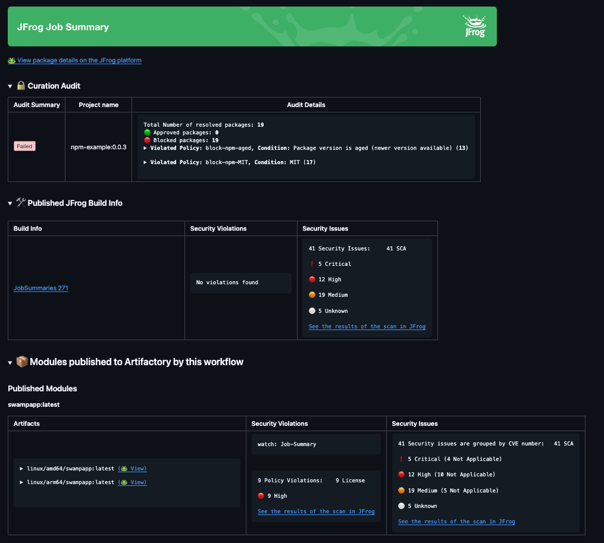
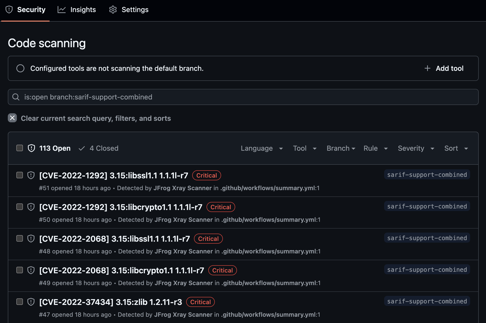

[](#readme)

<div align="center">

# Setup JFrog CLI

[](https://github.com/jfrog/frogbot#readme)
[](https://github.com/jfrog/setup-jfrog-cli/actions)

</div>

## Table of Contents

-   [Overview](#overview)
-   [Usage](#usage)
-   [Authentication Methods](#Authentication-Methods)
-   [General Configuration](#general-configuration)
    -   [Setting Build Name and Number for Build Info Publication](#setting-build-name-and-number-for-build-info-publication)
    -   [Setting JFrog CLI Version](#setting-jfrog-cli-version)
    -   [Setting the JFrog Project Key](#setting-the-jfrog-project-key)
    -   [Downloading JFrog CLI from Artifactory](#downloading-jfrog-cli-from-artifactory)
-   [JFrog Job Summary](#jfrog-job-summary)
-   [Code Scanning Alerts](#code-scanning-alerts)
-   [Example Projects](#example-projects)
-   [Contributions](#contributions)
-   [References](#references)

## Overview

This GitHub Action downloads, installs and configures [JFrog CLI](https://docs.jfrog-applications.jfrog.io/jfrog-applications/jfrog-cli), so that it can be used as part of the workflow.

Additionally, the Action incorporates the following features when utilizing JFrog CLI to interact with the JFrog Platform:

-   **Versatile authentication methods** - Three distinct methods are available for [authenticating](#Authentication-Methods) with the JFrog Platform.
-   **Seamless build info generation** - All build related operations will be automatically recorded, and the collected build info will be published at the end of the workflow. There's no need to add the _build name_ and _build number_ options and arguments to commands which accept them, and no need to run `jf rt build-publish` for the build to be published.
-   **Extensive Job Summary** - A detailed summary of key JFrog CLI commands executed during the workflow will be generated and displayed in the GitHub Actions run page. 

## Usage

```yml
- uses: jfrog/setup-jfrog-cli@v4
# + Authentication method
- run: jf --version
```

## Authentication Methods

JFrog CLI integrates with the JFrog Platform. In order to facilitate this connection, certain connection details of the JFrog Platform must be provided.
There are three methods to provide these details, and you only need to choose **one** method:

<details>
    <summary>👤 Connecting to JFrog using OIDC (OpenID Connect)</summary>

### General

The sensitive connection details, such as the access token used by JFrog CLI on the JFrog platform, can be automatically generated by the action instead of storing it as a secret in GitHub.
This is made possible by leveraging the OpenID-Connect (OIDC) protocol.
This protocol can authenticate the workflow issuer and supply a valid access token, requiring only the JF_URL environment variable.
Learn more about this integration in [this](https://jfrog.com/blog/secure-access-development-jfrog-github-oidc) blog post.
To utilize the OIDC protocol, follow these steps:

### JFrog Platform configuration

1. **Configure an OIDC Integration**: This phase sets an integration between GitHub Actions to the JFrog platform.
    1. Navigate to the Administration tab In the JFrog Platform UI
    2. Click `General` | `Manage Integrations`
    3. Click `New Integration` | `OpenID Connect`:
       
    4. Configure the OIDC integration:
       

| NOTE:                                                                                                                                                                                                                                          |
|------------------------------------------------------------------------------------------------------------------------------------------------------------------------------------------------------------------------------------------------|
| The value specified as the 'Provider Name' should be used as the oidc-provider-name input in [Workflow configuration step 2](#workflowstep2) below.                                                                                            |
| The 'Audience' field does not represent the 'aud' claim for insertion into the identity-mapping in [Platform configuration step 2](#platformstep2) below. Only the claims included in the Claims Json created during step 2 will be validated. |

<div id="platformstep2"></div>

2.  **Configure an identity mapping**: This phase sets an integration between a particular GitHub repository to the JFrog platform.

    An identity mapping is a configuration object utilized by the JFrog Platform to associate incoming OIDC claims with particular selected fields. These fields might include `repository`, `actor`, `workflow`, and others.
    To configure the identity mapping, click on the identity mapping created in section 1 and then click on `Add Identity Mapping`. Fill in priority 1 and fill out all required fields:
    

    You have the flexibility to define any valid list of claims required for request authentication. You can check a list of the possible claims [here](https://docs.github.com/en/actions/deployment/security-hardening-your-deployments/about-security-hardening-with-openid-connect#understanding-the-oidc-token).
    Example Claims JSON:

    ```json
    {
        "repository": "repository-owner/repository-name"
    }
    ```


### Workflow configuration

1.  **Set required permissions**: In the course of the protocol's execution, it's imperative to acquire a JSON Web Token (JWT) from GitHub's OIDC provider. To request this token, it's essential to configure the specified permission in the workflow file:

    ```yml
    permissions:
        id-token: write
    ```

    <div id="workflowstep2"></div>

2.  **Pass the 'oidc-provider-name' input to the Action (Required)**: The 'oidc-provider-name' parameter designates the OIDC configuration whose one of its identity mapping should align with the generated JWT claims. This input needs to align with the 'Provider Name' value established within the OIDC configuration in the JFrog Platform.
3.  **Pass the 'oidc-audience' input to the Action (Optional)**: The 'oidc-audience' input defines the intended recipients of an ID token (JWT), ensuring access is restricted to authorized recipients for the JFrog Platform. By default, it contains the URL of the GitHub repository owner. It enforces a condition, allowing only workflows within the designated repository/organization to request an access token. Read more about it [here](https://docs.github.com/en/actions/deployment/security-hardening-your-deployments/about-security-hardening-with-openid-connect#customizing-the-audience-value).

Example step utilizing OpenID Connect:

```yml
- uses: jfrog/setup-jfrog-cli@v4
  env:
      JF_URL: ${{ vars.JF_URL }}
  with:
      oidc-provider-name: setup-jfrog-cli
```

**Notice:** When using OIDC authentication, this action outputs both the OIDC token and the OIDC token username. These can be utilized within the current workflow to log into the JFrog platform through other actions or clients (e.g., for use with `docker login`). The added outputs are `oidc-token` and `oidc-user`, respectively.

</details>

<details>
    <summary>🔐 Storing the connection details using environment variables</summary>

### 
The connection details of the JFrog platform used by this action can be stored as [GitHub secrets](https://docs.github.com/en/actions/security-for-github-actions/security-guides/using-secrets-in-github-actions#creating-secrets-for-a-repository) (or [GitHub Variables](https://docs.github.com/en/actions/writing-workflows/choosing-what-your-workflow-does/variables) for non-secret values)

You can set the connection details to your JFrog Platform by using one of the following combinations:

1. JF_URL (no authentication)
2. JF_URL + JF_USER + JF_PASSWORD (basic authentication)
3. JF_URL + JF_ACCESS_TOKEN (authentication using a JFrog Access Token)

You can use these environment variables in your workflow as follows:

```yml
- uses: jfrog/setup-jfrog-cli@v4
  env:
    # JFrog Platform url
    JF_URL: ${{ vars.JF_URL }} # or 'https://acme.jfrog.io'

    # Basic authentication credentials
    JF_USER: ${{ secrets.JF_USER }}
    JF_PASSWORD: ${{ secrets.JF_PASSWORD }}
    # or
    # JFrog Platform access token
    JF_ACCESS_TOKEN: ${{ secrets.JF_ACCESS_TOKEN }}
- run: |
    jf rt ping
```

</details>

<details>
    <summary>⚙️ Storing the connection details using single Config Token</summary>

### 

1. Make sure JFrog CLI is installed on your local machine by running `jf -v`.
2. Configure the details of the JFrog platform by running `jf c add`.
3. Export the details of the JFrog platform you configured, using the server ID you chose. Do this by running `jf c export <SERVER ID>`.
4. Copy the generated Config Token to the clipboard and save it as a secret on GitHub.

To use the saved JFrog platform configuration in the workflow, all you need to do it to expose the secret to the workflow.
The secret should be exposed as an environment variable with the _JF*ENV*_ prefix.
Here's how you do this:

```yml
- uses: jfrog/setup-jfrog-cli@v4
  env:
      JF_ENV_1: ${{ secrets.JF_SECRET_ENV_1 }}
- run: |
      # Ping the server
      jf rt ping
```

As you can see in the example above, we created a secret named _JF_SECRET_ENV_1_ and exposed it to the workflow
as the _JF_ENV_1_ environment variable. That's it - the ping command will now ping the configured Artifactory server.

If you have multiple Config Tokens as secrets, you can use all of them in the workflow as follows:

```yml
- uses: jfrog/setup-jfrog-cli@v4
  env:
      JF_ENV_1: ${{ secrets.JF_SECRET_ENV_1 }}
      JF_ENV_2: ${{ secrets.JF_SECRET_ENV_2 }}
- run: |
      # Set the utilized JFrog configuration by providing the server ID (configured by the 'jf c add' command).
      jf c use local-1
      # Ping local-1 Artifactory server
      jf rt ping
      # Now use the second sever configuration exposed to the Action.
      jf c use local-2
      # Ping local-2 Artifactory server
      jf rt ping
```

| Important: When exposing more than one JFrog configuration to the Action, you should always add the `jf c use` command to specify the server to use. |
|------------------------------------------------------------------------------------------------------------------------------------------------------|

| Important: If both Config Token(`JF_ENV_*`) and separate environment variables(`JF_URL`, ...) are provided, the default config will be the Config Token. To make the above separate environment variables as the default config use `jf c use setup-jfrog-cli-server` |
|-----------------------------------------------------------------------------------------------------------------------------------------------------------------------------------------------------------------------------------------------------------------------|

</details>

## General Configuration
<details>
    <summary>Setting build name and number for build info publication to Artifactory</summary>

### Setting Build Name and Number for Build Info Publication
Build info collection and publication to Artifactory happens seamlessly when using the action in your workflow.\
The Action automatically sets the following environment variables:
_JFROG_CLI_BUILD_NAME_ and _JFROG_CLI_BUILD_NUMBER_ with the workflow name and run number respectively.
You therefore don't need to specify the build name and build number on any of the build related JFrog CLI commands.

In the following example, all downloaded files are registered as dependencies of the build and all uploaded files
are registered as the build artifacts.

```yml
- run: |
      jf rt download "my-repo/artifacts/*" local-dir/
      jf rt upload "local-dir/*" new-repo/my-artifacts/
      jf rt build-publish
```

You may override the default build name and number by setting the following environment variables in your workflow:
```yml
env:
  JFROG_CLI_BUILD_NAME: "Custom build name"
  JFROG_CLI_BUILD_NUMBER: "123"
```
</details>

<details>
    <summary>Setting JFrog CLI version</summary>

### Setting JFrog CLI Version

By default, the JFrog CLI version set in [action.yml](https://github.com/jfrog/setup-jfrog-cli/blob/master/action.yml) is used. To set a specific version, add the _version_ input as follows:

```yml
- uses: jfrog/setup-jfrog-cli@v4
  with:
      version: X.Y.Z
```

It is also possible to set the latest JFrog CLI version by adding the _version_ input as follows:

```yml
- uses: jfrog/setup-jfrog-cli@v4
  with:
      version: latest
```

| Important: Only JFrog CLI versions 1.46.4 or above are supported. |
|-------------------------------------------------------------------|

</details>

<details>
    <summary>Setting the JFrog project key</summary>

### Setting the JFrog Project Key

[JFrog Projects](https://jfrog.com/help/r/jfrog-platform-administration-documentation/projects) are a management entity that hosts all your resources related to a specific project,
such as repositories, builds and Release Bundles.

By default, the JFrog CLI accepts a project flag in some of its commands. 
You can set the project key in the environment variable ```JF_PROJECT``` to avoid passing it in each command.

```yml
- uses: jfrog/setup-jfrog-cli@v4
  env:
      JF_PROJECT: "project-key"
```
</details>

<details>
    <summary>Downloading JFrog CLI from Artifactory</summary>

### Downloading JFrog CLI from Artifactory

If your agent has no Internet access, you can configure the workflow to download JFrog CLI from a [remote repository](https://www.jfrog.com/confluence/display/JFROG/Remote+Repositories) in your JFrog Artifactory, which is configured to proxy the official download URL.

Here's how you do this:

1. Create a remote repository in Artifactory. Name the repository jfrog-cli-remote and set its URL to https://releases.jfrog.io/artifactory/jfrog-cli/
2. Set _download-repository_ input to jfrog-cli-remote:

    ```yml
    - uses: jfrog/setup-jfrog-cli@v4
      env:
          # JFrog platform url (for example: https://acme.jfrog.io)
          JF_URL: ${{ vars.JF_URL }}
          JF_ACCESS_TOKEN: ${{ secrets.JF_ACCESS_TOKEN }}

      with:
          download-repository: jfrog-cli-remote
    ```
</details>

## JFrog Job Summary

Workflows using this GitHub action will output a summary of some of the key commands that were performed using JFrog CLI.

The summary can be viewed from the GitHub Actions run page and is enabled by default.

### Preconditions
To fully leverage from the JFrog Job Summary, one should:
1. Use JFrog CLI version 2.66.0 or above.
2. Set `JF_URL` as a [GitHub Variable](https://docs.github.com/en/actions/writing-workflows/choosing-what-your-workflow-does/variables) rather than a [GitHub Secret](https://docs.github.com/en/actions/security-for-github-actions/security-guides/using-secrets-in-github-actions#creating-secrets-for-a-repository) (see note below).

> **_NOTE:_** The Job Summary includes direct links to the JFrog Platform UI, for applicable licenses. 
For the links to function correctly,
`JF_URL` should be set as a variable rather than a secret.
This is to prevent GitHub from masking the URL.

### Default Behavior:

By default, [build-info](https://jfrog.com/help/r/jfrog-pipelines-documentation/buildinfo) will be collected during the workflow and automatically published to Artifactory when the workflow completes.

This behavior is disabled if the `jf rt build-publish` command was manually run during the workflow, or if requested explicitly by setting the `disable-auto-build-publish` input to `true`:

```yml
- uses: jfrog/setup-jfrog-cli@v4
  with:
    disable-auto-build-publish: true
```

To disable the JFrog Job Summary altogether, set the `disable-job-summary` input to `true`:

```yml
- uses: jfrog/setup-jfrog-cli@v4
  with:
    disable-job-summary: true
```

### Published Sections
| Section                       | Command                                                                                      |
|-------------------------------|----------------------------------------------------------------------------------------------|
| Curation Audit                |  `jf mvn install`                               |
|                               |  `jf npm install`                                 |
|                               |  `jf pip/pipenv/poetry install`                  |
|                               |  `jf go build`                                     |
| Build Info                    | `jf rt build-publish` ([automatically](#default-behavior) or manually)                       |
| Build Info: Security          | `jf build-scan`                                                                              |
| Published Modules: Artifacts  |  `jf docker push`, `jf rt build-docker-create` |
|                               |  `jf mvn install`                               |
|                               |  `jf npm publish`                                 |
|                               |  `jf twine upload`                               |
|                               |  `jf go publish`                                   |
|                               |  `jf terraform publish`                     |
|                               |  `jf rt upload`                               |
| Published Modules: Security   |  `jf docker scan`                              |
| Code Scanning                 | `jf docker scan`, `jf scan`                                                                  |

### JFrog Job Summary Example



### Behind the scenes
The **setup-jfrog-cli GitHub Action** leverages the **Command Summaries** feature of the JFrog CLI
to generate a detailed summary of the entire workflow.

The final summary will include the summary of each CLI command that supports this feature.
To read more about the JFrog CLI supported commands, visit the following link:
[JFrog CLI Command Summaries Documentation](https://docs.jfrog-applications.jfrog.io/jfrog-applications/jfrog-cli/cli-command-summaries).

## Code Scanning Alerts

**Note:** To use code scanning alerts, ensure you are using JFrog CLI version `v2.67.0` or above.


The action also supports the display of code scanning alerts in the GitHub Actions UI.

Code scanning alerts are generated following the execution of the `jf docker scan` and `jf scan` commands.

This feature is available for customers with an Artifactory Enterprise license or above.

### Preconditions
`JF_GIT_TOKEN` - GitHub token with `security-events: write` permission.

You can utilize [$\{{secrets.GITHUB\_TOKEN\}}](https://docs.github.com/en/actions/security-guides/automatic-token-authentication) for `JF_GIT_TOKEN`, which is an automatically generated token by GitHub.

```yaml
permissions:
  id-token: write
  contents: read
  # Required for uploading code scanning.
  security-events: write
```

``` yaml
- uses: jfrog/setup-jfrog-cli@v4
  env:
    # The GitHub token is automatically generated for the job
    JF_GIT_TOKEN: ${{ secrets.GITHUB_TOKEN }}
```

### Code Scanning Alerts Example:



## Example Projects

To help you get started, you can use [these](https://github.com/jfrog/project-examples/tree/master/github-action-examples) sample projects on GitHub.

## Contributions

We welcome pull requests from the community. To help us improve this project, please read our [Contribution](./CONTRIBUTING.md#-guidelines) guide.

## References

-   [JFrog CLI Documentation](https://docs.jfrog-applications.jfrog.io/jfrog-applications/jfrog-cli)
-   [Secure Access To Your Software Development with GitHub OpenID Connect (OIDC) and JFrog](https://jfrog.com/blog/secure-access-development-jfrog-github-oidc/)
-   [GitHub Actions Documentation](https://docs.github.com/en/actions)
-   [Security hardening for GitHub Actions](https://docs.github.com/en/actions/security-guides/security-hardening-for-github-actions)
-   [Preventing pwn requests](https://securitylab.github.com/research/github-actions-preventing-pwn-requests/)
